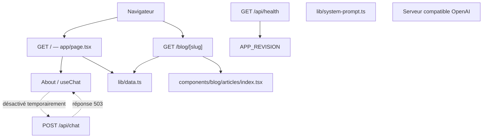

# Cartographie du projet

> Document de reprise destiné aux humains et aux agents IA. Il décrit le dépôt tel
> qu’il a été vérifié le 1er août 2026. Le code reste la source de vérité : avant
> toute intervention, relire `AGENTS.md`, exécuter `git status --short` et vérifier
> les fichiers concernés.

## 1. Résumé en une minute

Ce dépôt est le portfolio personnel d’Alex Commeau, en français, avec :

- une page d’accueil mono-page présentant profil, compétences, expérience, projets,
  formation, blog et contact ;
- un assistant conversationnel connecté à un serveur d’inférence compatible OpenAI ;
- un blog statique dont les articles sont des composants React/TSX ;
- un design sombre, responsive, construit avec Tailwind CSS et des primitives
  Base UI/shadcn.

Il n’y a actuellement ni base de données, ni authentification, ni stockage persistant,
ni CMS. Le contenu métier est principalement codé dans `lib/data.ts`.

État fonctionnel important :

- le chat est visible dans la section À propos, mais temporairement désactivé : son
  interface est en lecture seule et `POST /api/chat` répond `503` pendant la maintenance ;
- le formulaire de contact est simulé côté navigateur et n’envoie rien ;
- plusieurs liens, images et contenus de projets sont encore des placeholders ;
- l’interface parle de « RAG », mais aucune recherche documentaire/vectorielle
  n’existe dans ce dépôt : les données de `lib/data.ts` sont injectées dans un prompt.

## 2. Règle impérative avant de modifier du code

`AGENTS.md` impose de lire la documentation locale correspondant à cette version de
Next.js avant toute modification applicative. Ne pas se fier uniquement aux
connaissances générales sur Next.js : le projet utilise Next.js `16.2.10`.

Guides locaux utiles :

- structure : `node_modules/next/dist/docs/01-app/01-getting-started/02-project-structure.md` ;
- composants serveur/client :
  `node_modules/next/dist/docs/01-app/01-getting-started/05-server-and-client-components.md` ;
- Route Handlers :
  `node_modules/next/dist/docs/01-app/01-getting-started/15-route-handlers.md` ;
- routes dynamiques :
  `node_modules/next/dist/docs/01-app/03-api-reference/03-file-conventions/dynamic-routes.md` ;
- variables d’environnement :
  `node_modules/next/dist/docs/01-app/02-guides/environment-variables.md` ;
- version 16 :
  `node_modules/next/dist/docs/01-app/02-guides/upgrading/version-16.md`.

Toujours préserver les modifications déjà présentes dans le worktree.

## 3. Stack et commandes

| Élément | Version / rôle |
|---|---|
| Node.js | `>=22.0.0` ; Docker et `.nvmrc` fixent `22.23.1` |
| Next.js | `16.2.10`, App Router |
| React / React DOM | `19.2.4` |
| TypeScript | `^5`, mode strict |
| Tailwind CSS | `^4`, via PostCSS |
| AI SDK | `ai ^7.0.29`, `@ai-sdk/react ^4.0.32` |
| Fournisseur IA | `@ai-sdk/openai-compatible ^3.0.11` |
| Animations interactives | Motion `^12.43.0` |
| Primitives UI | Base UI, shadcn, Lucide React |
| Gestionnaire | npm, verrouillage par `package-lock.json` |

Commandes à lancer depuis la racine :

```bash
npm install
cp .env.local.example .env.local
npm run dev
npm run lint
npm run typecheck
npm run build
npm run start
docker build --build-arg APP_REVISION=$(git rev-parse HEAD) -t my-portfolio:local .
docker run --rm -p 3000:3000 my-portfolio:local
```

Notes :

- `package.json` exige Node.js 22 ou plus et `.nvmrc` fixe la version locale à
  `22.23.1`, identique à l'image de construction Docker.
- `npm run dev` écoute sur `http://localhost:8080`, car le port est fixé dans
  `package.json`.
- Le README généré mentionne encore le port 3000 : cette indication est obsolète.
- Aucun framework de tests fonctionnels ou unitaires n’est configuré ; la CI couvre
  actuellement le lint, les types, les builds Next.js/Docker et un smoke test HTTP.
- `npm run start` n’impose pas explicitement le port 8080.

## 4. Variables d’environnement

Le modèle attendu est documenté dans `.env.local.example`.

| Variable | Obligatoire | Utilisation |
|---|---:|---|
| `LLAMACPP_BASE_URL` | en pratique oui | API compatible OpenAI ; fallback `http://localhost:8080/v1` |
| `LLAMACPP_MODEL` | non | identifiant du modèle ; fallback `local-model` |
| `LLAMACPP_API_KEY` | selon le serveur | lu par l’application, mais absent du fichier exemple |
| `APP_REVISION` | non | SHA Git exposé par `/api/health` ; `unknown` hors build Docker versionné |

Attention au conflit de ports : le serveur Next.js de développement occupe le port
8080, également utilisé par le fallback de `LLAMACPP_BASE_URL`. Il faut presque
toujours définir cette variable vers un autre port ou une autre machine.

`next.config.ts` autorise explicitement `macbook-dev.local` et l'adresse LAN
`192.168.1.58` pour les ressources et endpoints propres au serveur de développement
Next.js. Si l'adresse ou le nom local change, il faut mettre à jour cette liste et
redémarrer le serveur. Ces hôtes ne doivent pas être remplacés par `*`.

Ne jamais mettre de secret dans ce document ou committer `.env.local`.

## 5. Exécution Docker

`next.config.ts` active `output: "standalone"`. Le Dockerfile multi-stage utilise
l'image officielle `node:22.23.1-bookworm-slim`, verrouillée par digest, installe les
dépendances avec `npm ci`, construit Next.js, puis copie uniquement le serveur tracé,
`public/` et `.next/static/` dans l'image finale. Le processus s'exécute avec
l'utilisateur non-root `nextjs` sur le port 3000.

Le build accepte `APP_REVISION` comme argument et le conserve dans un label OCI ainsi
que dans l'environnement du conteneur. Le healthcheck Docker interroge
`GET /api/health`. Aucun fichier `.env` n'entre dans le contexte Docker.

Le workflow `.github/workflows/ci.yml` exécute deux jobs distincts :

- `validate` s'exécute sur chaque Pull Request, push vers `main` et lancement manuel.
  Il installe les dépendances, lance ESLint et TypeScript, construit Next.js, puis
  construit et démarre l'image Docker afin de vérifier son utilisateur non-root, son
  label de révision, son healthcheck et la page d'accueil ;
- `publish` ne s'exécute qu'après la réussite de `validate` sur `main`. Il publie la
  même révision dans GHCR sous les tags immuable `sha-<commit>` et mobile `main`.

Le job de validation est en lecture seule. Seul le job de publication reçoit
temporairement la permission `packages: write` via `GITHUB_TOKEN`; aucun jeton GitHub
longue durée n'est stocké dans le dépôt. L'image cible est
`ghcr.io/alexcommeau/my-portfolio`.

## 6. Architecture générale



La majorité des composants d’affichage sont rendus côté serveur. Les composants
portant `"use client"` gèrent les interactions, les animations ou le chat.

## 7. Arborescence commentée

```text
.
├── app/
│   ├── layout.tsx                 # HTML racine, polices et métadonnées globales
│   ├── page.tsx                   # Composition et ordre des sections
│   ├── globals.css                # Tailwind, thème et animations
│   ├── api/chat/route.ts          # POST de streaming vers le modèle
│   ├── api/health/route.ts        # état du conteneur et révision déployée
│   └── blog/[slug]/page.tsx       # Page statique dynamique d’un article
├── components/
│   ├── portfolio/                 # Sections et interactions de l’accueil
│   ├── blog/                      # Coquille et blocs des articles
│   │   └── articles/              # Contenu TSX et registre slug -> composant
│   └── ui/                        # Primitives génériques Base UI/shadcn
├── lib/
│   ├── data.ts                    # Source centrale du contenu
│   ├── system-prompt.ts           # Prompt généré depuis les données
│   └── utils.ts                   # cn() = clsx + tailwind-merge
├── public/
│   └── images/hero.webp           # Seule image métier finale utilisée
├── Dockerfile                     # image Next.js standalone multi-stage
├── .dockerignore                  # exclut secrets, dépendances et artefacts locaux
├── .nvmrc                         # Node.js 22.23.1
├── .github/workflows/
│   └── ci.yml                     # validation PR/main et publication GHCR sur main
├── components.json                # Configuration shadcn et alias
├── next.config.ts                 # allowedDevOrigins
├── package.json                   # Scripts et dépendances
├── tsconfig.json                  # TypeScript strict, alias @/*
├── eslint.config.mjs              # ESLint Next + TypeScript
├── postcss.config.mjs             # Plugin Tailwind CSS 4
└── .env.local.example             # Exemple de configuration locale
```

Les SVG Next/Vercel encore présents dans `public/` sont des reliquats du scaffold et
ne sont pas importés.

## 8. Routes et points d’entrée

### `GET /`

`app/page.tsx` assemble, dans cet ordre :

1. `Navbar`
2. `Hero`
3. `About`
4. `Skills`
5. `Experience`
6. `Projects`
7. `Education`
8. `Contact`
9. `Footer`

Le tout est enveloppé dans `AboutTabProvider`, qui partage l’onglet actif de la section
À propos entre `About` et `Projects`.

Ancres actives : `hero`, `about`, `skills`, `experience`, `projects`, `education`,
`contact`. Le composant `Blog` existe, mais il n’est actuellement pas monté dans
`app/page.tsx`. `navItems` dans `lib/data.ts` doit rester synchronisé avec les ancres
actives.

### `GET /blog/[slug]`

`app/blog/[slug]/page.tsx` :

- pré-génère les slugs de `blogPosts` avec `generateStaticParams()` ;
- produit les métadonnées depuis l’entrée correspondante ;
- exige que le même slug existe aussi dans `articleRegistry` ;
- renvoie `notFound()` si les métadonnées ou le composant manquent.

Il n’y a pas de route `/blog` autonome. Le composant de liste existe mais est
actuellement désactivé sur `/` ; les articles restent accessibles directement par
leur slug.

### `POST /api/chat`

La route est temporairement neutralisée et répond `503` avec un message de
maintenance. L'interface du chat reste visible dans
`components/portfolio/about.tsx`, mais ne charge plus `useChat` et désactive les
suggestions ainsi que la saisie. La logique d'inférence, le prompt et les dépendances
sont conservés pour la remise en service ultérieure. Les anciens extraits de la route
et de l'interface active sont gardés en commentaires dans les fichiers concernés.

La route reste publique, sans authentification, quota ou rate limiting.

### `GET /api/health`

La route renvoie un JSON `{ status: "ok", revision }` avec HTTP 200 et l'en-tête
`Cache-Control: no-store`. `revision` provient de `APP_REVISION`, injecté comme
argument lors du build Docker, ou vaut `unknown` en développement local.

## 9. Cartographie des composants

### `components/portfolio/`

| Fichier | Responsabilité | État / dépendances |
|---|---|---|
| `navbar.tsx` | navigation desktop/mobile et scroll fluide | client ; `navItems`, `Sheet` |
| `hero.tsx` | introduction, rôle animé, portrait avec tilt et CTA | client ; Motion, `roles`, `hero.webp` |
| `about.tsx` | onglets Profil/Chat et interface du chat | client ; état de maintenance temporaire |
| `ui-context.tsx` | état partagé `aboutTab` | client |
| `skills.tsx` | grilles de compétences | `skillGroups` |
| `experience.tsx` | chronologie professionnelle | `experiences` |
| `projects.tsx` | filtres IA/Web et cartes projet | client ; contexte partagé |
| `education.tsx` | cartes de formation | `education` |
| `blog.tsx` | cartes vers les articles | `blogPosts` |
| `contact.tsx` | formulaire contrôlé | client ; simulation uniquement |
| `footer.tsx` | ancres, liens sociaux et copyright | `navItems` |
| `reveal.tsx` | animation via `IntersectionObserver` | client |
| `image-placeholder.tsx` | visuel temporaire | Lucide |
| `social-icons.tsx` | SVG GitHub, LinkedIn et email | autonome |

### `components/blog/`

- `article-nav.tsx` : retour à l’accueil ;
- `article-header.tsx` : tag, date, auteur et rôle ;
- `article-callout.tsx` : encart éditorial ;
- `article-code-block.tsx` : bloc de code stylisé ;
- `article-tags.tsx` : liste de tags ;
- `article-cta.tsx` : liens vers le chat et le contact ;
- `article-footer.tsx` : pied de page minimal ;
- `articles/index.tsx` : registre obligatoire des composants d’articles ;
- `articles/rag-auto-heberge.tsx` : seul article complet actuel.

### `components/ui/`

`button.tsx`, `input.tsx`, `textarea.tsx` et `sheet.tsx` sont des primitives génériques.
Elles suivent le style shadcn/Base UI. Ne pas y placer de contenu métier.

## 10. Sources de données

`lib/data.ts` centralise :

- `navItems` : navigation et footer ;
- `roles` : animation du Hero ;
- `bio` et `aboutCards` : onglet Profil ;
- `skillGroups` : compétences et prompt IA ;
- `experiences` : expérience et prompt IA ;
- `projectsData` et `filters` : projets, filtres et prompt IA ;
- `education` : formation et prompt IA ;
- `blogPosts` : cartes, slugs et métadonnées du blog ;
- `chatQA` : questions suggérées, sans réponses prédéfinies.

`lib/system-prompt.ts` utilise `bio`, `education`, `experiences`, `projectsData` et
`skillGroups`. Modifier ces collections change le site et les connaissances du modèle.

Ne sont pas injectés dans le prompt : `aboutCards`, `roles`, `blogPosts`, `chatQA`,
les articles et les coordonnées écrites directement dans les composants.

## 11. Flux interactifs

### Chat

`About` affiche temporairement un panneau de maintenance statique. Les suggestions,
la saisie et le transport `useChat` ne sont pas chargés, et `POST /api/chat` répond
`503`. Le code de référence nécessaire à la réactivation est conservé en commentaires
dans la route et le composant.

### Navigation et état partagé

- Chaque ancre de section utilise un marqueur invisible, sans dimension et placé à la
  position finale du titre, hors du conteneur animé. Les ancres natives et les appels
  à `scrollIntoView` partagent un offset global de 116 px, afin de placer chaque titre
  30 px sous la navbar sticky de 86 px.
- Le menu mobile est un `Sheet` contrôlé par l’état `open`.
- La Démo du premier projet sélectionne l’onglet Chat via `AboutTabProvider`, puis
  défile vers `#about`.
- Les autres navigations internes utilisent des ancres.

### Contact

`Contact` conserve quatre champs dans `useState`. À la soumission, il vide les champs
et affiche un succès. Aucun `fetch`, email, stockage ou endpoint n’est appelé.

## 12. Styles et conventions

- Mode sombre forcé par `app/layout.tsx`.
- Polices Inter et JetBrains Mono via `next/font`.
- Palette Zinc, Cyan, Teal et Amber.
- Conteneur habituel : `max-w-6xl` avec `px-8`.
- Sections séparées par `border-zinc-900` et animées par `Reveal`.
- Tailwind CSS 4 et tokens shadcn dans `app/globals.css`.
- Alias TypeScript `@/*` vers la racine.
- Contenu et interface en français.
- Exports applicatifs généralement nommés ; pages/layouts en export par défaut.
- Utiliser `cn()` pour les classes conditionnelles.

## 13. Procédures d’extension

### Modifier une information du portfolio

Commencer par `lib/data.ts`, puis vérifier son impact dans `lib/system-prompt.ts`.
Les coordonnées email et certains textes du Hero sont encore écrits directement dans
les composants.

### Ajouter une section à l’accueil

1. Ajouter les données dans `lib/data.ts` si nécessaire.
2. Créer le composant dans `components/portfolio/`.
3. L’ajouter dans `app/page.tsx`.
4. Donner à la section un `id` stable.
5. Ajouter l’entrée à `navItems` si elle doit être navigable.
6. Vérifier desktop, mobile, menu mobile et footer.

### Ajouter un article

1. Ajouter ses métadonnées et son slug dans `blogPosts`.
2. Créer le contenu dans `components/blog/articles/`.
3. L’importer dans `components/blog/articles/index.tsx`.
4. Enregistrer exactement le même slug dans `articleRegistry`.
5. Vérifier `/`, `/blog/<slug>`, les métadonnées et `npm run build`.

Il n’existe ni MDX ni découverte automatique : oublier le registre rend l’article
introuvable.

### Modifier le chat

Considérer ensemble :

- UI/transport : `components/portfolio/about.tsx` ;
- endpoint/modèle : `app/api/chat/route.ts` ;
- connaissances : `lib/system-prompt.ts` et `lib/data.ts`.

Un vrai RAG nécessitera de nouvelles briques d’ingestion, stockage, recherche et
citation ; elles n’existent pas encore.

### Remplacer une image temporaire

Ajouter l’asset optimisé dans `public/images/`, puis remplacer `ImagePlaceholder` par
`next/image` avec dimensions, `alt` descriptif et `sizes` responsive.

## 14. Inachèvements et risques connus

- GitHub, LinkedIn, CV, « Voir l’architecture » et certains liens projet : `href="#"`.
- Email : `alex.commeau@example.com`, donc adresse placeholder.
- Formulaire de contact : faux succès, aucune transmission.
- Images de projets, blog, auteur et schéma : `ImagePlaceholder`.
- Description du premier projet : contient encore du Lorem ipsum.
- Badge « Disponible » et état du serveur GPU : codés en dur.
- Le système est présenté comme RAG, mais le backend est un prompt statique enrichi.
- `.env.local.example` omet `LLAMACPP_API_KEY`, pourtant l’application la lit.
- API chat sans validation du corps, limitation d’usage ou protection d’accès.
- Aucun test automatisé, CI visible, suivi analytique ou SEO avancé.
- README générique et incorrect sur le port de développement.

Ces points ne sont pas forcément à corriger dans une mission non liée. Ils évitent
surtout de prendre un placeholder pour une fonctionnalité finale.

## 15. Checklist de reprise pour une IA

1. Lire la demande et délimiter le périmètre.
2. Lire `AGENTS.md`.
3. Exécuter `git status --short` et préserver les changements existants.
4. Lire les guides Next.js locaux pertinents avant d’écrire du code.
5. Relire les fichiers concernés et leurs consommateurs.
6. Modifier la plus petite surface cohérente.
7. Exécuter au minimum `npm run lint` et `npm run typecheck`.
8. Exécuter `npm run build` pour une route, le rendu, la configuration, une dépendance,
   un article ou des données statiques.
9. Vérifier visuellement mobile et desktop pour un changement d’interface.
10. Mettre ce document à jour si l’architecture, les flux, commandes ou variables
    d’environnement changent.

## 16. Validation actuelle

En l’absence de suite de tests :

```bash
npm run lint
npm run typecheck
npm run build
```

Pour une modification visuelle, inspecter `/` en mobile et desktop, le menu mobile,
les filtres projets, le passage Projet → Chat, les onglets Profil/Chat et
`/blog/rag-auto-heberge`.

Pour tester réellement le chat, un serveur compatible OpenAI accessible via
`LLAMACPP_BASE_URL` est requis.

Dernier contrôle, le 31 juillet 2026 avec Node.js `22.18.0` :

- `npm run lint` : réussi ;
- `npx tsc --noEmit` : réussi ;
- `npm run build` : réussi.
