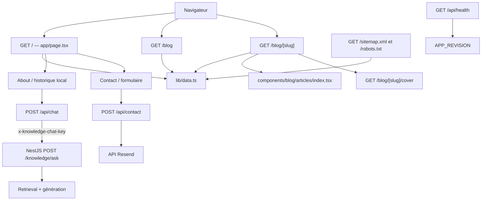

# Cartographie du projet

> Document de reprise destiné aux humains et aux agents IA. Il décrit le dépôt tel
> qu’il a été vérifié le 10 août 2026. Le code reste la source de vérité : avant
> toute intervention, relire `AGENTS.md`, exécuter `git status --short` et vérifier
> les fichiers concernés.

## 1. Résumé en une minute

Ce dépôt est le portfolio personnel d’Alex Commeau, en français, avec :

- une page d’accueil mono-page présentant profil, projets, compétences, expérience,
  formation et contact ;
- un assistant conversationnel relié au backend RAG NestJS par une façade Next.js ;
- un index de blog autonome et des articles statiques écrits en composants React/TSX ;
- un socle SEO avec URLs canoniques, sitemap, robots, données structurées et
  images sociales générées ;
- un design sombre, responsive, construit avec Tailwind CSS et des primitives
  Base UI/shadcn.

Il n’y a actuellement ni base de données, ni authentification, ni stockage persistant,
ni CMS. Le contenu métier est principalement codé dans `lib/data.ts`.

État fonctionnel important :

- le chat de la section À propos est actif : `POST /api/chat` valide et limite les
  requêtes, puis appelle le backend NestJS sans exposer sa clé de service ;
- le formulaire de contact poste vers `POST /api/contact`, qui valide la saisie avec
  zod puis relaie le message par l’API HTTP Resend ; il répond `503` tant que
  `RESEND_API_KEY` est absente ;
- plusieurs liens, images et contenus de projets sont encore des placeholders ;
- la recherche vectorielle et la génération vivent dans le dépôt backend
  `my-portfolio-backend` ; ce dépôt ne contient ni connaissances ni prompt RAG.

## 2. Règle impérative avant de modifier du code

`AGENTS.md` impose de lire la documentation locale correspondant à cette version de
Next.js avant toute modification applicative. Ne pas se fier uniquement aux
connaissances générales sur Next.js : le projet utilise Next.js `16.2.10`.

Guides locaux utiles :

- structure : `node_modules/next/dist/docs/01-app/01-getting-started/02-project-structure.md` ;
- composants serveur/client :
  `node_modules/next/dist/docs/01-app/01-getting-started/05-server-and-client-components.md` ;
- Route Handlers :
  `node_modules/next/dist/docs/01-app/01-getting-started/15-route-handlers.md` ;
- routes dynamiques :
  `node_modules/next/dist/docs/01-app/03-api-reference/03-file-conventions/dynamic-routes.md` ;
- variables d’environnement :
  `node_modules/next/dist/docs/01-app/02-guides/environment-variables.md` ;
- version 16 :
  `node_modules/next/dist/docs/01-app/02-guides/upgrading/version-16.md`.

Toujours préserver les modifications déjà présentes dans le worktree.

## 3. Stack et commandes

| Élément                 | Version / rôle                                   |
| ----------------------- | ------------------------------------------------ |
| Node.js                 | `>=22.0.0` ; Docker et `.nvmrc` fixent `22.23.1` |
| Next.js                 | `16.2.10`, App Router                            |
| React / React DOM       | `19.2.4`                                         |
| TypeScript              | `^5`, mode strict                                |
| Tailwind CSS            | `^4`, via PostCSS                                |
| AI SDK                  | `ai ^7.0.29`, `@ai-sdk/react ^4.0.32`, réservés au futur streaming |
| Animations interactives | Motion `^12.43.0`                                |
| Primitives UI           | Base UI, shadcn, Lucide React                    |
| Gestionnaire            | npm, verrouillage par `package-lock.json`        |

Commandes à lancer depuis la racine :

```bash
npm install
cp .env.local.example .env.local
npm run dev
npm run lint
npm run typecheck
npm run build
npm run start
docker build --build-arg APP_REVISION=$(git rev-parse HEAD) -t my-portfolio:local .
docker run --rm -p 3000:3000 my-portfolio:local
```

Notes :

- `package.json` exige Node.js 22 ou plus et `.nvmrc` fixe la version locale à
  `22.23.1`, identique à l'image de construction Docker.
- `npm run dev` écoute sur `http://localhost:8080`, car le port est fixé dans
  `package.json`.
- `.claude/launch.json` lance le serveur via `zsh`, initialise NVM et sélectionne
  une version Node.js 22 avant d’appeler `npm run dev`.
- Le README généré mentionne encore le port 3000 : cette indication est obsolète.
- Aucun framework de tests fonctionnels ou unitaires n’est configuré ; la CI couvre
  actuellement le lint, les types, les builds Next.js/Docker et un smoke test HTTP.
- `npm run start` n’impose pas explicitement le port 8080.

## 4. Variables d’environnement

Le modèle attendu est documenté dans `.env.local.example`.

| Variable                    |      Obligatoire | Utilisation                                                              |
| --------------------------- | ---------------: | ------------------------------------------------------------------------ |
| `KNOWLEDGE_API_BASE_URL`    | pour le chat oui | URL privée du backend NestJS, sans suffixe `/knowledge/ask`              |
| `KNOWLEDGE_CHAT_KEY`        | pour le chat oui | secret partagé Next.js → NestJS, jamais exposé au navigateur             |
| `KNOWLEDGE_API_TIMEOUT_MS`  |              non | timeout du RAG ; fallback `90000`                                        |
| `APP_REVISION`              |              non | SHA Git exposé par `/api/health` ; `unknown` hors build Docker versionné |
| `RESEND_API_KEY`            | pour l’envoi oui | clé API Resend ; sans elle `POST /api/contact` répond `503`              |
| `CONTACT_TO_EMAIL`          |              non | destinataire du formulaire ; fallback `alexcommeau@gmail.com`           |

Les variables de chat et de contact sont lues **dans leurs handlers**, jamais au
chargement du module : la CI exécute `next build` sans secret. `.dockerignore`
excluant `.env*`, elles doivent être injectées au runtime et jamais au build.

En développement, `KNOWLEDGE_API_BASE_URL=http://127.0.0.1:3001` vise NestJS sur
le Mac. Si NestJS tourne sur le k8 derrière un tunnel
`ssh -N -L 3002:127.0.0.1:3001 k8`, utiliser `http://127.0.0.1:3002`. En production,
la variable doit viser le nom ou l’adresse privée joignable depuis le conteneur
Next.js. La même `KNOWLEDGE_CHAT_KEY` doit être injectée dans les deux processus.

`next.config.ts` autorise explicitement `macbook-dev.local` et l'adresse LAN
`192.168.1.58` pour les ressources et endpoints propres au serveur de développement
Next.js. Si l'adresse ou le nom local change, il faut mettre à jour cette liste et
redémarrer le serveur. Ces hôtes ne doivent pas être remplacés par `*`.

Ne jamais mettre de secret dans ce document ou committer `.env.local`.

## 5. Exécution Docker

`next.config.ts` active `output: "standalone"`. Le Dockerfile multi-stage utilise
l'image officielle `node:22.23.1-bookworm-slim`, verrouillée par digest, installe les
dépendances avec `npm ci`, construit Next.js, puis copie uniquement le serveur tracé,
`public/` et `.next/static/` dans l'image finale. Le processus s'exécute avec
l'utilisateur non-root `nextjs` sur le port 3000.

Le build accepte `APP_REVISION` comme argument et le conserve dans un label OCI ainsi
que dans l'environnement du conteneur. Le healthcheck Docker interroge
`GET /api/health`. Aucun fichier `.env` n'entre dans le contexte Docker.

Le workflow `.github/workflows/ci.yml` exécute deux jobs distincts :

- `validate` s'exécute sur chaque Pull Request, push vers `main` et lancement manuel.
  Il installe les dépendances, lance ESLint et TypeScript, construit Next.js, puis
  construit et démarre l'image Docker afin de vérifier son utilisateur non-root, son
  label de révision, son healthcheck et la page d'accueil ;
- `publish` ne s'exécute qu'après la réussite de `validate` sur `main`. Il publie la
  même révision dans GHCR sous les tags immuable `sha-<commit>` et mobile `main`.

Le job de validation est en lecture seule. Seul le job de publication reçoit
temporairement la permission `packages: write` via `GITHUB_TOKEN`; aucun jeton GitHub
longue durée n'est stocké dans le dépôt. L'image cible est
`ghcr.io/alexcommeau/my-portfolio`.

## 6. Architecture générale



La majorité des composants d’affichage sont rendus côté serveur. Les composants
portant `"use client"` gèrent les interactions, les animations ou le chat.

## 7. Arborescence commentée

```text
.
├── app/
│   ├── layout.tsx                 # HTML racine, polices et métadonnées globales
│   ├── robots.ts                  # directives d'exploration et URL du sitemap
│   ├── sitemap.ts                 # accueil, index du blog et articles
│   ├── social-image/route.ts      # image sociale globale générée
│   ├── page.tsx                   # Composition et ordre des sections
│   ├── globals.css                # Tailwind, thème, défilement et animations
│   ├── api/chat/route.ts          # façade JSON validée et limitée vers NestJS
│   ├── api/contact/route.ts       # POST validé, anti-spam et relais Resend
│   ├── api/health/route.ts        # état du conteneur et révision déployée
│   ├── blog/page.tsx              # Index statique des articles
│   ├── blog/[slug]/page.tsx       # Page statique dynamique d’un article
│   └── blog/[slug]/cover/route.ts # Couverture PNG générée par article
├── components/
│   ├── portfolio/                 # Sections, Hero et interactions de l’accueil
│   ├── blog/                      # Index, navigation et blocs des articles
│   │   └── articles/              # Contenu TSX et registre slug -> composant
│   └── ui/                        # Primitives génériques Base UI/shadcn
├── lib/
│   ├── blog.ts                    # dates, URLs, navigation et articles associés
│   ├── blog-cover.tsx             # rendu ImageResponse des couvertures
│   ├── data.ts                    # Source centrale du contenu
│   ├── site.ts                    # domaine canonique, identité, auteur et schéma Person
│   ├── contact-schema.ts          # Schéma zod partagé client/serveur du contact
│   ├── chat-schema.ts             # Contrats zod de la façade et du composant chat
│   └── utils.ts                   # cn() = clsx + tailwind-merge
├── public/
│   └── images/                    # Portrait et fond décoratif de l’accueil
├── .claude/launch.json            # lancement local avec NVM et Node.js 22
├── Dockerfile                     # image Next.js standalone multi-stage
├── .dockerignore                  # exclut secrets, dépendances et artefacts locaux
├── .nvmrc                         # Node.js 22.23.1
├── .github/workflows/
│   └── ci.yml                     # validation PR/main et publication GHCR sur main
├── components.json                # Configuration shadcn et alias
├── next.config.ts                 # allowedDevOrigins
├── package.json                   # Scripts et dépendances
├── tsconfig.json                  # TypeScript strict, alias @/*
├── eslint.config.mjs              # ESLint Next + TypeScript
├── postcss.config.mjs             # Plugin Tailwind CSS 4
└── .env.local.example             # Exemple de configuration locale
```

Les SVG Next/Vercel encore présents dans `public/` sont des reliquats du scaffold et
ne sont pas importés.

## 8. Routes et points d’entrée

### `GET /`

`app/page.tsx` assemble, dans cet ordre :

1. `Navbar`
2. `Hero`
3. `About`
4. `Projects`
5. `Skills`
6. `Experience`
7. `Education`
8. `Contact`
9. `Footer`

Le tout est enveloppé dans `AboutTabProvider`, qui partage l’onglet actif de la section
À propos entre `About` et `Projects`.

Ancres actives : `hero`, `about`, `projects`, `skills`, `experience`, `education`,
`contact`. L’entrée Blog de `navItems` pointe vers la route autonome `/blog` ; les
autres entrées doivent rester synchronisées avec les identifiants portés par les
éléments `<section>`.

### `GET /blog`

`app/blog/page.tsx` affiche un article à la une puis la grille des autres entrées de
`blogPosts`. La page réutilise la navbar du portfolio, ajoute une sous-navigation
sticky avec `BlogSubnav`, puis affiche `ArticleFooter`.

### `GET /blog/[slug]`

`app/blog/[slug]/page.tsx` :

- pré-génère les slugs de `blogPosts` avec `generateStaticParams()` ;
- produit les métadonnées canoniques, Open Graph et Twitter depuis l’entrée
  correspondante ;
- exige que le même slug existe aussi dans `articleRegistry` ;
- renvoie `notFound()` si les métadonnées ou le composant manquent ;
- embarque les JSON-LD `BlogPosting`, `Person` et `BreadcrumbList` ;
- affiche une table des matières, une progression de lecture, l'auteur, les articles
  plus récents/anciens et trois recommandations calculées par tags ;
- réutilise `Navbar` et `BlogSubnav` pour revenir à l’index ou à l’accueil.

### Routes SEO et images sociales

- `GET /robots.txt` autorise l'exploration publique et référence
  `https://alexcommeau.com/sitemap.xml` ;
- `GET /sitemap.xml` contient l'accueil, `/blog` et chaque article avec sa date de
  modification et sa couverture ;
- `GET /social-image` génère le fallback social global en 1200×630 ;
- `GET /blog/[slug]/cover` pré-génère une couverture 1200×630 propre à chaque
  article. La même URL sert aux cartes, à la page article, à Open Graph, Twitter,
  au sitemap image et au JSON-LD.

Le domaine canonique est centralisé dans `lib/site.ts` et vaut
`https://alexcommeau.com`. La configuration Cloudflare, le DNS et l'hébergement ne
font pas partie du dépôt et ne doivent pas être modifiés dans ce flux.

### `POST /api/chat`

La route est la façade publique même origine du chat. Elle accepte uniquement
`{ question }`, normalise les espaces, refuse les champs inconnus et impose une
longueur de 3 à 500 caractères avec `lib/chat-schema.ts`.

Elle applique une fenêtre glissante de 10 requêtes par 10 minutes et par IP, puis
appelle `POST /knowledge/ask` sur le backend NestJS avec le header privé
`x-knowledge-chat-key`. Le navigateur ne reçoit que `{ answer, answered }` : clé,
modèle, scores, chunks, chemins et sources restent côté serveur.

| Code  | Cas                                                               |
| ----- | ----------------------------------------------------------------- |
| `200` | réponse RAG valide                                                |
| `400` | JSON, question ou champs invalides                                |
| `429` | quota IP dépassé, avec `Retry-After`                              |
| `502` | backend inaccessible ou contrat de réponse invalide               |
| `503` | URL/clé absente ou backend RAG indisponible                       |
| `504` | timeout de la chaîne retrieval + génération                       |

Toutes les réponses portent `Cache-Control: no-store`. Les erreurs publiques sont
génériques ; le détail d’infrastructure reste dans les logs serveur. La limitation
est en mémoire et suppose que le reverse proxy de production réécrive les headers IP.

### `POST /api/contact`

Reçoit le corps JSON `{ name, email, subject, message, company }` produit par le
formulaire. Le handler enchaîne, dans cet ordre : limitation par IP, lecture du corps,
piège honeypot, validation zod, lecture de la clé API, appel Resend.

| Code  | Corps                                                        | Cas                                    |
| ----- | ------------------------------------------------------------ | -------------------------------------- |
| `200` | `{ ok: true }`                                               | envoi réussi, ou honeypot rempli       |
| `400` | `{ ok: false, error, fieldErrors? }`                         | JSON illisible ou validation échouée   |
| `429` | `{ ok: false, error }` + `Retry-After`                       | quota IP dépassé                       |
| `502` | `{ ok: false, error }`                                       | Resend en échec, timeout ou réseau     |
| `503` | `{ ok: false, error }`                                       | `RESEND_API_KEY` absente               |

Détails importants :

- le schéma zod vit dans `lib/contact-schema.ts` et sert **aussi** au client, qui
  pré-valide avant tout appel réseau ; les messages d’erreur sont en français ;
- le champ `company` est un honeypot : rempli, la route renvoie `200` sans rien
  envoyer, pour que le bot n’apprenne pas le piège ;
- limitation : 5 requêtes par tranche de 10 minutes et par IP, sur une fenêtre
  glissante conservée dans une `Map` en mémoire, l’IP étant lue dans
  `x-forwarded-for` puis `x-real-ip` ;
- l’email part en texte brut, avec `from` fixé au domaine bac à sable Resend,
  `reply_to` sur l’adresse du visiteur et un sujet préfixé `[Portfolio] ` qui sert de
  critère au filtre Gmail ;
- toutes les réponses portent `Cache-Control: no-store` ; le détail des erreurs Resend
  reste dans les logs serveur et n’est jamais renvoyé au client.

### `GET /api/health`

La route renvoie un JSON `{ status: "ok", revision }` avec HTTP 200 et l'en-tête
`Cache-Control: no-store`. `revision` provient de `APP_REVISION`, injecté comme
argument lors du build Docker, ou vaut `unknown` en développement local.

## 9. Cartographie des composants

### `components/portfolio/`

| Fichier                 | Responsabilité                                                  | État / dépendances                                           |
| ----------------------- | --------------------------------------------------------------- | ------------------------------------------------------------ |
| `navbar.tsx`            | navigation desktop/mobile vers les sections                     | client ; `navItems`, `SectionLink`, état du menu mobile      |
| `section-link.tsx`      | scroll Motion vers les sections sans fragment d’URL             | client ; Motion, Router Next.js, cible temporaire en session |
| `hero/hero.tsx`         | introduction, rôle animé, portrait avec bordure interactive et CTA | client ; Motion, `roles`, `hero.webp`                      |
| `about.tsx`             | onglets Profil/Chat et interface du chat                        | client ; historique visuel, requêtes indépendantes           |
| `ui-context.tsx`        | état partagé `aboutTab`                                         | client                                                       |
| `skills.tsx`            | grilles de compétences                                          | `skillGroups`                                                |
| `experience.tsx`        | chronologie professionnelle avec fade-up progressif des entrées | `experiences`, `SectionReveal`                               |
| `projects.tsx`          | filtres IA/Web et cartes projet                                 | client ; contexte partagé                                    |
| `education.tsx`         | cartes de formation                                             | `education`                                                  |
| `contact.tsx`           | formulaire contrôlé, validé et envoyé                           | client ; `contactSchema`, `POST /api/contact`                |
| `footer.tsx`            | ancres, liens sociaux et copyright                              | `navItems`                                                   |
| `image-placeholder.tsx` | visuel temporaire                                               | Lucide                                                       |
| `social-icons.tsx`      | SVG GitHub, LinkedIn et email                                   | autonome                                                     |

### `components/blog/`

- `blog-card.tsx` : carte réutilisable de l’index ;
- `blog-cover.tsx` : couverture générée affichée avec `next/image` ;
- `blog-subnav.tsx` : sous-navigation sticky de l’index et des articles ;
- `article-header.tsx` : tag, date, auteur et rôle ;
- `article-reading-progress.tsx` : wrapper client qui mesure uniquement l'article ;
- `article-table-of-contents.tsx` : ancres accessibles des grandes sections ;
- `article-author.tsx` : preuve d'auteur et liens professionnels ;
- `article-navigation.tsx` : plus récent, plus ancien et « À lire aussi » ;
- `article-heading.tsx` : titre `h2` de section, style et décalage d'ancre partagés ;
- `article-callout.tsx` : encart éditorial ;
- `article-code-block.tsx` : bloc de code stylisé ;
- `article-tags.tsx` : liste de tags ;
- `article-cta.tsx` : liens vers le chat et le contact ;
- `article-footer.tsx` : pied de page minimal ;
- `json-ld.tsx` : injecte des données structurées JSON-LD échappées ;
- `articles/index.tsx` : registre obligatoire des composants d’articles ;
- `articles/*.tsx` : quatre articles complets, enregistrés explicitement par slug et
  rendus statiquement sans animation d'apparition.

### `components/ui/`

`button.tsx`, `input.tsx`, `textarea.tsx` et `sheet.tsx` sont des primitives génériques
shadcn/Base UI. `section-reveal.tsx` centralise le fade-up Motion du portfolio ; le
blog ne l'utilise pas afin de conserver un rendu immédiat et robuste sans JavaScript.
Ne pas placer de contenu métier dans ce dossier.

## 10. Sources de données

`lib/data.ts` centralise :

- `navItems` : navigation et footer ;
- `roles` : animation du Hero ;
- `bio` et `aboutCards` : onglet Profil ;
- `skillGroups` : compétences affichées ;
- `experiences` : expérience affichée ;
- `projectsData` et `filters` : projets et filtres ;
- `education` : formation affichée ;
- `blogPosts` : cartes, slugs, dates ISO, tags, intention de recherche, couverture,
  table des matières et métadonnées du blog ;
- `chatQA` : questions suggérées, sans réponses prédéfinies.

Les connaissances du RAG ne sont plus dérivées de ces collections. Elles sont
maintenues et indexées dans `my-portfolio-backend/knowledges/`. Modifier
`lib/data.ts` change l’affichage du site, pas les réponses de l’assistant.

## 11. Flux interactifs

### Chat

`About` conserve un historique visuel en mémoire, mais chaque requête envoyée à
`POST /api/chat` contient seulement la nouvelle question. Une seule requête peut être
en cours ; suggestions et saisie sont alors désactivées. Le composant affiche les
paragraphes en texte simple, sans sources ni rendu Markdown, et fait défiler la zone
vers le dernier message. L’historique disparaît au rechargement de la page.

### Navigation et état partagé

- Chaque composant de section porte directement son identifiant d’ancre sur son
  élément `<section>`.
- `SectionLink` intercepte les liens de section sur l’accueil et anime la position
  avec Motion, selon une durée adaptée à la distance et une courbe ease-in-out. Les
  identifiants de section ne sont jamais ajoutés à l’URL.
- Depuis `/blog` ou un article, `SectionLink` conserve temporairement l’identifiant
  ciblé dans `sessionStorage`, navigue vers `/`, puis positionne la page sans
  animation. Le blog et ses articles n’ont donc aucune animation de scroll.
- `app/globals.css` conserve `scroll-behavior: auto` et un `scroll-padding-top` de
  `20px`. Les mouvements réduits désactivent également l’animation Motion.
- Le menu mobile est un panneau déroulant simple contrôlé par l’état `open`. Il
  n’utilise pas de dialogue modal et ne verrouille pas le défilement de la page.
- La Démo du premier projet sélectionne l’onglet Chat via `AboutTabProvider`, puis
  utilise `SectionLink` vers la section À propos.
- Les autres navigations internes vers une section utilisent `SectionLink`, sauf les
  liens externes et les placeholders sans destination réelle.

### Contact

`Contact` pilote une machine à quatre états : `idle`, `submitting`, `success` et
`error`. À la soumission, le composant valide d’abord la saisie avec `contactSchema`
— aucun appel réseau si elle est incomplète — puis poste vers `POST /api/contact`.

- les erreurs par champ s’affichent sous le contrôle concerné et activent les styles
  `aria-invalid` déjà portés par `Input` et `Textarea`, avec `aria-describedby` vers le
  message ; l’erreur d’un champ disparaît dès qu’il est corrigé ;
- le formulaire porte `noValidate` : les messages français du schéma remplacent les
  bulles natives du navigateur, qui suivent la langue du système ;
- en cas d’échec, les valeurs saisies sont conservées ; elles ne sont vidées qu’au
  succès, suivi d’un bouton « Envoyer un autre message » qui repasse en `idle` ;
- le bouton est désactivé pendant l’envoi et affiche « Envoi en cours… » ;
- le honeypot `company` est déporté hors écran plutôt que masqué en `display:none`,
  avec `aria-hidden`, `tabIndex={-1}` et `autoComplete="off"` pour rester invisible aux
  lecteurs d’écran, au clavier et aux gestionnaires de mots de passe.

## 12. Styles et conventions

- Mode sombre forcé par `app/layout.tsx`.
- Polices Inter et JetBrains Mono via `next/font`.
- Palette Zinc, Cyan, Teal et Amber.
- Conteneur habituel : `max-w-6xl` avec `px-8`.
- Sections du portfolio séparées par `border-zinc-900`. Leur contenu complet, Hero inclus, est
  enveloppé par `SectionReveal` pour un fade-up Motion joué une seule fois à l’entrée
  dans le viewport et neutralisé lorsque les mouvements réduits sont demandés. Les
  entrées de la chronologie Expérience réutilisent ce wrapper avec un léger délai
  progressif.
- L’index et les articles du blog n'utilisent aucun `SectionReveal` : titres,
  couvertures, paragraphes et blocs de fin sont visibles dès le HTML initial.
- Le défilement Motion animé est réservé à l’accueil. Sur le blog, seule la barre
  de progression des articles est liée au défilement : elle est fixée sous la
  sous-navigation à `top: 134px`, suit la hauteur de l'élément `<article>` et est
  masquée avec `prefers-reduced-motion`.
- Tailwind CSS 4 et tokens shadcn dans `app/globals.css`.
- Alias TypeScript `@/*` vers la racine.
- Contenu et interface en français.
- Exports applicatifs généralement nommés ; pages/layouts en export par défaut.
- Utiliser `cn()` pour les classes conditionnelles.

## 13. Procédures d’extension

### Modifier une information du portfolio

Commencer par `lib/data.ts`. Les connaissances conversationnelles sont indépendantes
et doivent être modifiées dans le dépôt backend avant une réindexation. Les liens
sociaux et certains textes du Hero sont encore écrits directement dans les composants.

### Ajouter une section à l’accueil

1. Ajouter les données dans `lib/data.ts` si nécessaire.
2. Créer le composant dans `components/portfolio/`.
3. L’ajouter dans `app/page.tsx`.
4. Donner à la section un `id` stable.
5. Ajouter l’entrée à `navItems` si elle doit être navigable.
6. Vérifier desktop, mobile, menu mobile et footer.

### Ajouter un article

1. Ajouter ses métadonnées et son slug dans `blogPosts`.
   Renseigner notamment les dates ISO, les tags, l'intention de recherche, le chemin
   de couverture et les identifiants de table des matières.
2. Créer le contenu dans `components/blog/articles/`.
   Utiliser `ArticleHeading` pour chaque grande section ; son `id` doit correspondre
   à l'entrée de `sections`.
3. L’importer dans `components/blog/articles/index.tsx`.
4. Enregistrer exactement le même slug dans `articleRegistry`.
5. Vérifier `/blog`, `/blog/<slug>`, les métadonnées et `npm run build`.

Il n’existe ni MDX ni découverte automatique : oublier le registre rend l’article
introuvable.

### Modifier le chat

Considérer ensemble :

- UI et historique local : `components/portfolio/about.tsx` ;
- contrats partagés : `lib/chat-schema.ts` ;
- validation, quota et proxy : `app/api/chat/route.ts` ;
- retrieval, prompt, LLM et connaissances : dépôt `my-portfolio-backend`.

Le contrat actuel est un JSON synchrone. Le futur streaming devra ajouter une route
distincte côté NestJS et côté Next.js, propager l’annulation du navigateur et conserver
la route JSON comme fallback et point de test.

### Modifier le formulaire de contact

Considérer ensemble :

- règles de saisie et messages : `lib/contact-schema.ts`, partagé client/serveur ;
- transport, anti-spam et destinataire : `app/api/contact/route.ts` ;
- interface et états : `components/portfolio/contact.tsx`.

Toute nouvelle variable d’environnement doit être ajoutée à `.env.local.example` et au
tableau de la section 4, et rester lue à l’intérieur du handler.

### Remplacer une image temporaire

Ajouter l’asset optimisé dans `public/images/`, puis remplacer `ImagePlaceholder` par
`next/image` avec dimensions, `alt` descriptif et `sizes` responsive.

### Notes privées d’amélioration

Les améliorations futures et sujets de sécurité à traiter sont suivis localement dans
`.private/FUTURE_IMPROVEMENTS.md`. Le dossier est ignoré par Git et exclu du contexte
Docker : son contenu ne doit jamais être commité, publié ou utilisé pour stocker des
secrets. Cette liste est un aide-mémoire local, pas un mécanisme de sécurité.

## 14. Inachèvements et risques connus

- CV, « Voir l’architecture » et certains liens projet : `href="#"`.
- Formulaire de contact : la limitation par IP vit en mémoire, donc elle repart de zéro
  à chaque redémarrage du conteneur et ne tiendrait pas en multi-instance ni en runtime
  edge. `x-forwarded-for` reste falsifiable tant qu’aucun reverse proxy de confiance ne
  le réécrit, et sans cet en-tête toutes les requêtes partagent le même compteur. Le
  domaine bac à sable `onboarding@resend.dev` n’autorise l’envoi qu’à l’adresse du
  titulaire du compte Resend ; envoyer ailleurs exigera un domaine vérifié.
- Les images de projets restent des `ImagePlaceholder`. Les couvertures de blog sont
  des visuels générés, l'auteur réutilise `hero.webp` et le schéma RAG est rendu en
  HTML/CSS accessible ; de vraies illustrations pourront les remplacer plus tard.
- Plusieurs projets utilisent encore un titre ou une description « à venir ».
- Badge « Disponible » et état du serveur GPU : codés en dur.
- Le quota du chat vit en mémoire : il repart de zéro au redémarrage, n’est pas partagé
  entre instances et dépend d’un reverse proxy qui réécrit les headers IP.
- Le chat est synchrone : aucune réponse token par token ni annulation propagée au
  backend n’existe encore.
- Aucun test automatisé, suivi analytique ou intégration Search Console.
- README générique et incorrect sur le port de développement.

Ces points ne sont pas forcément à corriger dans une mission non liée. Ils évitent
surtout de prendre un placeholder pour une fonctionnalité finale.

## 15. Checklist de reprise pour une IA

1. Lire la demande et délimiter le périmètre.
2. Lire `AGENTS.md`.
3. Exécuter `git status --short` et préserver les changements existants.
4. Lire les guides Next.js locaux pertinents avant d’écrire du code.
5. Relire les fichiers concernés et leurs consommateurs.
6. Modifier la plus petite surface cohérente.
7. Exécuter au minimum `npm run lint` et `npm run typecheck`.
8. Exécuter `npm run build` pour une route, le rendu, la configuration, une dépendance,
   un article ou des données statiques.
9. Vérifier visuellement mobile et desktop pour un changement d’interface.
10. Mettre ce document à jour si l’architecture, les flux, commandes ou variables
    d’environnement changent.

## 16. Validation actuelle

En l’absence de suite de tests :

```bash
npm run lint
npm run typecheck
npm run build
```

Pour une modification visuelle, inspecter `/` en mobile et desktop, le menu mobile,
les filtres projets, le passage Projet → Chat, les onglets Profil/Chat, `/blog` et un
article comme `/blog/rag-auto-heberge`.

Pour tester réellement le chat, le backend NestJS, son index et ses serveurs
d’embedding/génération doivent être accessibles via `KNOWLEDGE_API_BASE_URL`.

Contrôle du chat, le 10 août 2026 avec Node.js `24.14.0` :

- lint, typecheck et build Next.js : réussis ;
- appel réel navigateur → `/api/chat` → NestJS → RAG : réussi ;
- la réponse publique ne contient ni citation `[S…]`, ni source structurée, ni clé ;
- la clé de service est absente de `.next/static` ;
- quota vérifié : dix requêtes comptabilisées dans la fenêtre, puis HTTP `429` ;
- contrôles du chat à 390×844 et 1440×900 : aucun débordement horizontal et
  aucune erreur ou alerte dans la console.

Contrôle SEO/blog précédent, le 6 août 2026 avec Node.js `22.23.1` :

- `npm run lint` : réussi ;
- `npm run typecheck` : réussi ;
- `npm run build` : réussi ;
- `git diff --check` : réussi ;
- `/robots.txt`, `/sitemap.xml`, les quatre articles et les cinq routes PNG : HTTP
  200 avec les types de contenu attendus ;
- contrôles navigateur réussis à 390×844 et 1440×900 : index, article RAG,
  couvertures, table des matières, absence de débordement horizontal et barre de
  progression fixée à 134 px ; aucune erreur ni avertissement dans la console.
- les quatre HTML d'articles ne contiennent aucun état initial masqué de
  `SectionReveal` ; le contenu reste rendu statiquement sans JavaScript.
